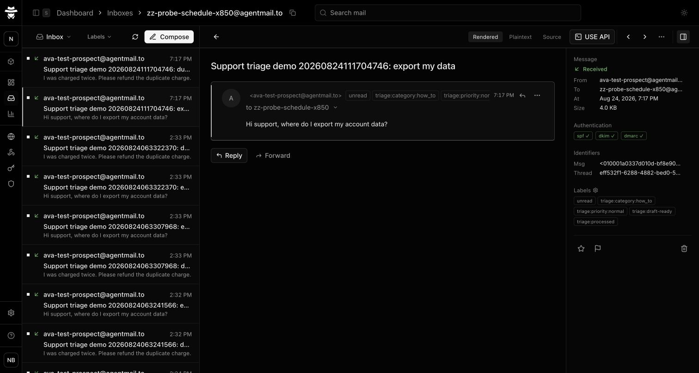
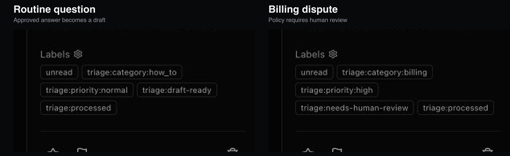
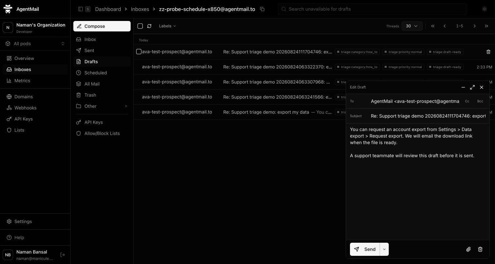
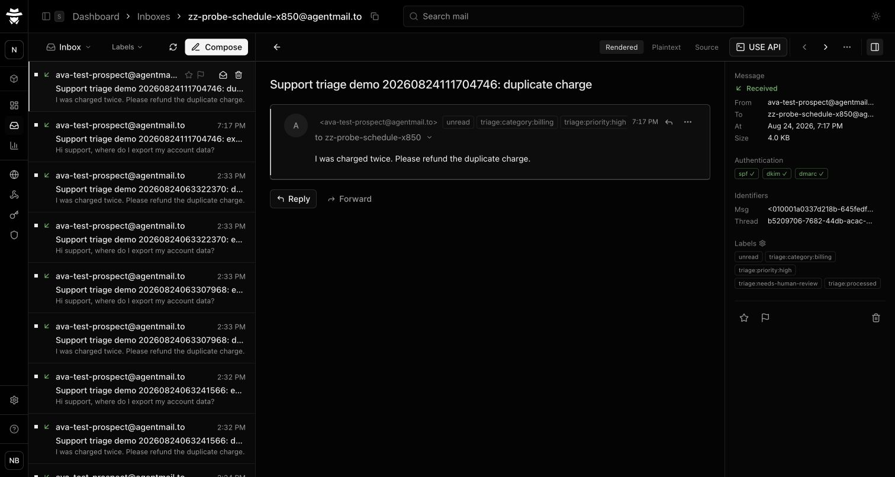
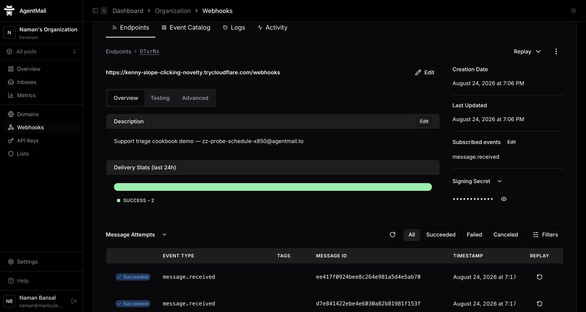

# AgentMail support triage agent

Give a support agent its own AgentMail inbox. Routine questions become labeled, same-thread reply drafts; billing, account-access, and other sensitive requests wait for a person without generating a draft.

[Watch the 24-second guided run](assets/support-triage-guided-run.mp4) or read the [complete cookbook](https://github.com/maniculehq/manicule/blob/codex/agentmail-support-triage-assets/tmp/agentmail-support-triage-cookbook/post.md). The walkthrough uses a large cursor, visible click markers, and pauses on both label sets.





## What the demo proves

- AgentMail signs and delivers each `message.received` webhook; the receiver verifies it before parsing.
- OpenAI returns a closed category, priority, summary, and optional knowledge-article key.
- Application code—not the model—decides whether a draft is allowed.
- Approved answers become same-thread drafts. Sensitive messages get a human-review label and no draft.
- SQLite stores one canonical decision per event—even when deliveries overlap. A stable AgentMail `clientId` and `triage:processed` make the remaining network retries consistent.





## Run it

You need Bun, an AgentMail support inbox, an OpenAI API key, and a public HTTPS tunnel to local port 3000. Keep credentials separated by job:

- The runtime key is scoped to the support inbox with `Inbox Read`, `Message Read`, `Message Update`, `Draft Read`, and `Draft Create`. It has no send permission.
- A temporary setup key for the same inbox has `Webhook Create`. Delete it after setup.
- The optional demo sender key belongs to a second inbox and has `Message Send`.

```sh
git clone https://github.com/agentmail-to/support-triage-agent-blog.git
cd support-triage-agent-blog
bun install
cp .env.example .env.runtime
cp .env.setup.example .env.setup
cp .env.demo.example .env.demo
```

Create the support inbox in AgentMail and copy its address into each environment file. Put the runtime and setup keys in their respective files, then add your tunnel's `/webhooks` URL to `.env.setup`:

```sh
bun --env-file=.env.setup run setup:agentmail
```

Copy the generated webhook signing secret from `.env.agentmail.local` into `.env.runtime`, delete the temporary setup key, and start the receiver:

```sh
bun --env-file=.env.runtime run dev
```

To run the automated check, add a separate sender inbox and sender key to `.env.demo`, along with the runtime key and support inbox ID:

```sh
bun --env-file=.env.demo run demo
```

You can skip the sender key and send the two messages from your own mailbox instead. The receiver never loads `.env.demo`.

The live check sends two messages and validates these outcomes:

| Request | Labels | Draft |
| --- | --- | --- |
| Export my data | `how_to`, `normal`, `draft-ready`, `processed` | Approved same-thread reply |
| Duplicate charge | `billing`, `high`, `needs-human-review`, `processed` | None |



## Verify the code

```sh
bun run typecheck
bun run test
```

The test suite covers signature rejection, successful signed delivery, same-thread drafting, sensitive-message handoff, overlapping-delivery consistency, and processed-event replay.

The guided video is reproducible from the checked-in Remotion source:

```sh
bun run render:video
```

## Safety boundary

The classifier cannot write customer-facing copy or authorize sending. It can select only one of the knowledge-article keys defined in `src/triage.ts`; `src/policy.ts` maps those keys to support-approved text and permits drafts only for low- or normal-priority how-to questions. The runtime key omits both `Message Send` and `Draft Send`, so the server cannot email a customer even if policy code regresses.

See the AgentMail guides for [webhook verification](https://docs.agentmail.to/webhook-verification), [drafts](https://docs.agentmail.to/drafts), and [idempotent requests](https://docs.agentmail.to/idempotency).
